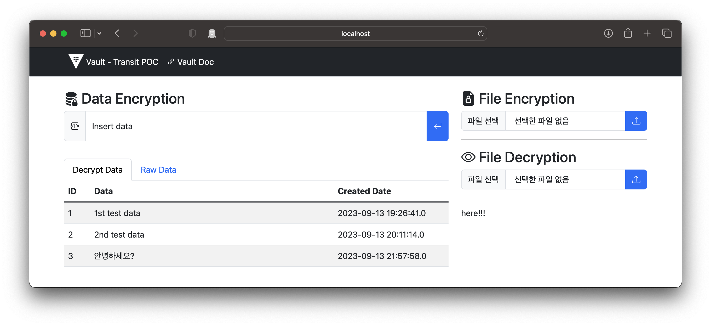

# Transit - Java Spring Boot

## 빌드 환경 및 빌드

### Java 17+

```bash
$ java -version
java -version                
openjdk version "17.0.8" 2023-07-18
OpenJDK Runtime Environment Homebrew (build 17.0.8+0)
OpenJDK 64-Bit Server VM Homebrew (build 17.0.8+0, mixed mode, sharing)
```

### Gradle 8

```bash
$ gradle -version

------------------------------------------------------------
Gradle 8.2.1
------------------------------------------------------------

Build time:   2023-07-10 12:12:35 UTC
Revision:     a38ec64d3c4612da9083cc506a1ccb212afeecaa

Kotlin:       1.8.20
Groovy:       3.0.17
Ant:          Apache Ant(TM) version 1.10.13 compiled on January 4 2023
JVM:          20.0.1 (Homebrew 20.0.1)
OS:           Mac OS X 13.5.1 aarch64
```

### Build

```bash
$ pwd
/a/b/c/java-app

$ gradle build

$ ls ./app/build/lib/
```


## Vault 환경

### Transit 활성화

```bash
$ vault secrets enable transit
```

### Trasit 키 생성

```bash
$ vault write -f transit/keys/ds-poc type=aes256-gcm96

Key                       Value
---                       -----
allow_plaintext_backup    false
auto_rotate_period        0s
deletion_allowed          false
derived                   false
exportable                false
imported_key              false
keys                      map[1:1694166532]
latest_version            1
min_available_version     0
min_decryption_version    1
min_encryption_version    0
name                      ds-poc
supports_decryption       true
supports_derivation       true
supports_encryption       true
supports_signing          false
type                      aes256-gcm96
```

### Transit 생성된 키 확인

```bash
$ vault list transit/keys

Keys
----
ds-poc
```

### Transit 암호화 테스트

```bash
$ vault write transit/encrypt/ds-poc plaintext=$(echo "My Data" | base64)

Key            Value
---            -----
ciphertext     vault:v1:ZwX8OwN9/1EOticsdacRUZY5cONc/aH8bt1StS8JG/pNQSsP
key_version    1
```

### Transit 복호화 테스트

```bash
$ vault write transit/decrypt/ds-poc ciphertext='vault:v1:ZwX8OwN9/1EOticsdacRUZY5cONc/aH8bt1StS8JG/pNQSsP'

Key          Value
---          -----
plaintext    TXkgRGF0YQo=

$ echo TXkgRGF0YQo= | base64 -d

My Data
```

## MySQL 8.0.31

- version : 8.0.31
- port : 3306
- user/pw : admin/password

### mysql client (macos - option)

```bash
$ brew install mysql-client
$ echo 'export PATH="/opt/homebrew/opt/mysql-client/bin:$PATH"' >> ~/.zshrc
```

### mysql connect

```bash
$ export MYSQL_HOST=127.0.0.1
$ export MYSQL_PORT=3306
$ mysql -h $MYSQL_HOST -p $MYSQL_PORT -u root -ppassword

# if docker
$ docker exec -it mysql mysql -u root -ppassword

mysql: [Warning] Using a password on the command line interface can be insecure.
Welcome to the MySQL monitor.  Commands end with ; or \g.
Your MySQL connection id is 10
Server version: 8.0.31 MySQL Community Server - GPL

Copyright (c) 2000, 2022, Oracle and/or its affiliates.

Oracle is a registered trademark of Oracle Corporation and/or its
affiliates. Other names may be trademarks of their respective
owners.

Type 'help;' or '\h' for help. Type '\c' to clear the current input statement.

mysql>
```

### mysql create table example

```sql
CREATE DATABASE VaultData;
```

### mysql user create

```sql
CREATE USER app@'%' IDENTIFIED BY 'password';

GRANT ALL PRIVILEGES
    ON VaultData.*
    TO app@'%';

FLUSH PRIVILEGES;
```

### mysql table example

```sql
USE VaultData;

create table vault_data (
  id int unsigned auto_increment not null,
  data varchar(200) not null,
  date_created timestamp default now(),
  primary key (id)
);
```

### mysql insert test

```sql
INSERT INTO vault_data (data) VALUES ('1st test data');

SELECT * FROM vault_data;
```

Output sample
```log
+----+---------------+---------------------+
| id | data          | date_created        |
+----+---------------+---------------------+
|  1 | 1st test data | 2023-09-08 10:25:25 |
+----+---------------+---------------------+
1 row in set (0.00 sec)
```


## Java Run

### 환경변수 구성
```bash
export MYSQL_HOST=127.0.0.1
export MYSQL_PORT=3306
export MYSQL_DB_NAME=VaultData
export MYSQL_USERNAME=app
export MYSQL_USERPW=password
export VAULT_HOST=127.0.0.1
export VAULT_PORT=8200
export VAULT_SCHEME=http
export VAULT_TOKEN=root
export VAULT_TRANSIT_KEY_NAME=ds-poc
export S3_ENABLE=true
export S3_BUCKET_NAME=vault-transit-file-encryption-poc
export AWS_REGION=ap-northeast-2

# Optino
export AWS_ACCESS_KEY_ID=ASI12312312312
export AWS_SECRET_ACCESS_KEY=SKadfaewr12123123
```

### Gracle Boot 실행
```bash
gradle bootRun
```

### 빌드
```bash
gradle build
```

### 실행
```bash
java -jar demo-0.1.2.jar
```

[](http://localhost:8080/) 접속하여 Insert Data에 데이터 추가하고 웹에서는 잘 나타나는지 확인

Mysql에서 조회
```sql
mysql> SELECT * FROM vault_data;
+----+-------------------------------------------------------------------+----------------------------+
| id | data                                                              | date_created               |
+----+-------------------------------------------------------------------+----------------------------+
|  1 | 1st test data                                                     | 2023-09-08 10:25:25.000000 |
|  2 | 2nd test data                                                     | 2023-09-08 21:35:47.359000 |
|  3 | vault:v1:crYoSFh9zQ73cZmpwCiH89Tjs+IBKbEQ97cPYZ4gNdTp5sm7D32rzvY= | 2023-09-08 22:21:27.623000 |
|  4 | vault:v1:QPRoQ1JPKKoRAyS9NZ203RwA6inlpD2MCyICJECW7EjDD8Ai2yZvv80= | 2023-09-08 22:46:36.339000 |
+----+-------------------------------------------------------------------+----------------------------+
```

### Vault Transit Rotate

```bash
$ vault write -f transit/keys/ds-poc/rotate

Key                       Value
---                       -----
allow_plaintext_backup    false
auto_rotate_period        0s
deletion_allowed          false
derived                   false
exportable                false
imported_key              false
keys                      map[1:1694166532 2:1694181431]
latest_version            2
min_available_version     0
min_decryption_version    1
min_encryption_version    0
name                      ds-poc
supports_decryption       true
supports_derivation       true
supports_encryption       true
supports_signing          false
type                      aes256-gcm96
```

웹페이지에서 새로운 값 입력 후 Mysql에서 조회

```sql
mysql> SELECT * FROM vault_data;
+----+-------------------------------------------------------------------+----------------------------+
| id | data                                                              | date_created               |
+----+-------------------------------------------------------------------+----------------------------+
|  1 | 1st test data                                                     | 2023-09-08 10:25:25.000000 |
|  2 | 2nd test data                                                     | 2023-09-08 21:35:47.359000 |
|  3 | vault:v1:crYoSFh9zQ73cZmpwCiH89Tjs+IBKbEQ97cPYZ4gNdTp5sm7D32rzvY= | 2023-09-08 22:21:27.623000 |
|  4 | vault:v1:QPRoQ1JPKKoRAyS9NZ203RwA6inlpD2MCyICJECW7EjDD8Ai2yZvv80= | 2023-09-08 22:46:36.339000 |
|  5 | vault:v2:WVQHgYp8qOIxmhi+ZvhLXIhaqr74XOU8AHeWCMTaEfQmPyEhsVimOvU= | 2023-09-08 22:58:00.362000 |
+----+-------------------------------------------------------------------+----------------------------+
```

decryption 최소 버전 조정

```bash
$ vault write -f transit/keys/ds-poc/config min_decryption_version=2
```

Web 출력 확인



### Stress Test (K6)

```bash
# k6 directory
$ k6 run main.js

          /\      |‾‾| /‾‾/   /‾‾/   
     /\  /  \     |  |/  /   /  /    
    /  \/    \    |     (   /   ‾‾\  
   /          \   |  |\  \ |  (‾)  | 
  / __________ \  |__| \__\ \_____/ .io

  execution: local
     script: main.js
     output: -

  scenarios: (100.00%) 1 scenario, 100 max VUs, 40s max duration (incl. graceful stop):
           * default: 100 looping VUs for 10s (gracefulStop: 30s)


     data_received..................: 674 kB 67 kB/s
     data_sent......................: 1.8 MB 174 kB/s
     http_req_blocked...............: avg=38.73µs  min=0s       med=2µs      max=4.08ms   p(90)=4µs      p(95)=5µs    
     http_req_connecting............: avg=26.84µs  min=0s       med=0s       max=2.86ms   p(90)=0s       p(95)=0s     
     http_req_duration..............: avg=8.42ms   min=2.1ms    med=6.55ms   max=86.98ms  p(90)=14.22ms  p(95)=18.82ms
       { expected_response:true }...: avg=8.42ms   min=2.1ms    med=6.55ms   max=86.98ms  p(90)=14.22ms  p(95)=18.82ms
     http_req_failed................: 0.00%  ✓ 0          ✗ 9232 
     http_req_receiving.............: avg=16.95µs  min=3µs      med=13µs     max=889µs    p(90)=28µs     p(95)=36µs   
     http_req_sending...............: avg=11.67µs  min=2µs      med=8µs      max=2.04ms   p(90)=18µs     p(95)=25µs   
     http_req_tls_handshaking.......: avg=0s       min=0s       med=0s       max=0s       p(90)=0s       p(95)=0s     
     http_req_waiting...............: avg=8.39ms   min=2.06ms   med=6.53ms   max=86.96ms  p(90)=14.19ms  p(95)=18.79ms
     http_reqs......................: 9232   913.290162/s
     iteration_duration.............: avg=108.68ms min=102.28ms med=106.77ms max=191.32ms p(90)=114.37ms p(95)=119ms  
     iterations.....................: 9232   913.290162/s
     vus............................: 100    min=100      max=100
     vus_max........................: 100    min=100      max=100


running (10.1s), 000/100 VUs, 9232 complete and 0 interrupted iterations
default ✓ [======================================] 100 VUs  10s
```